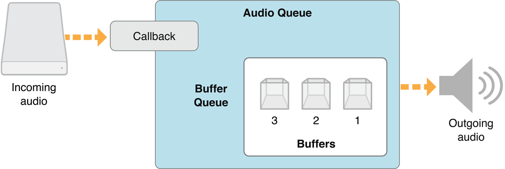
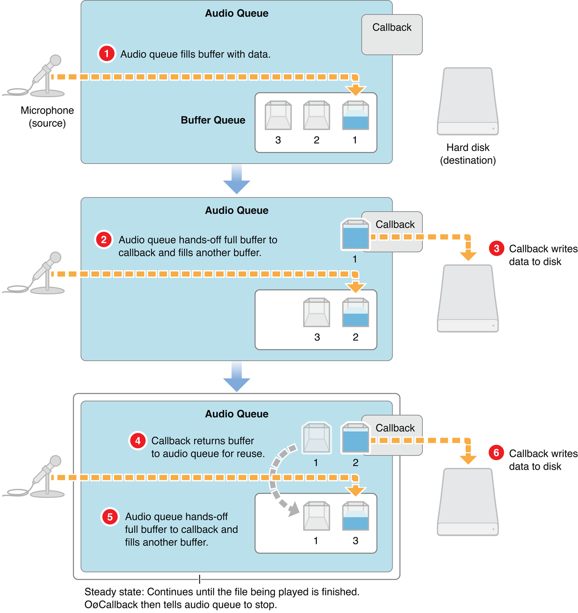
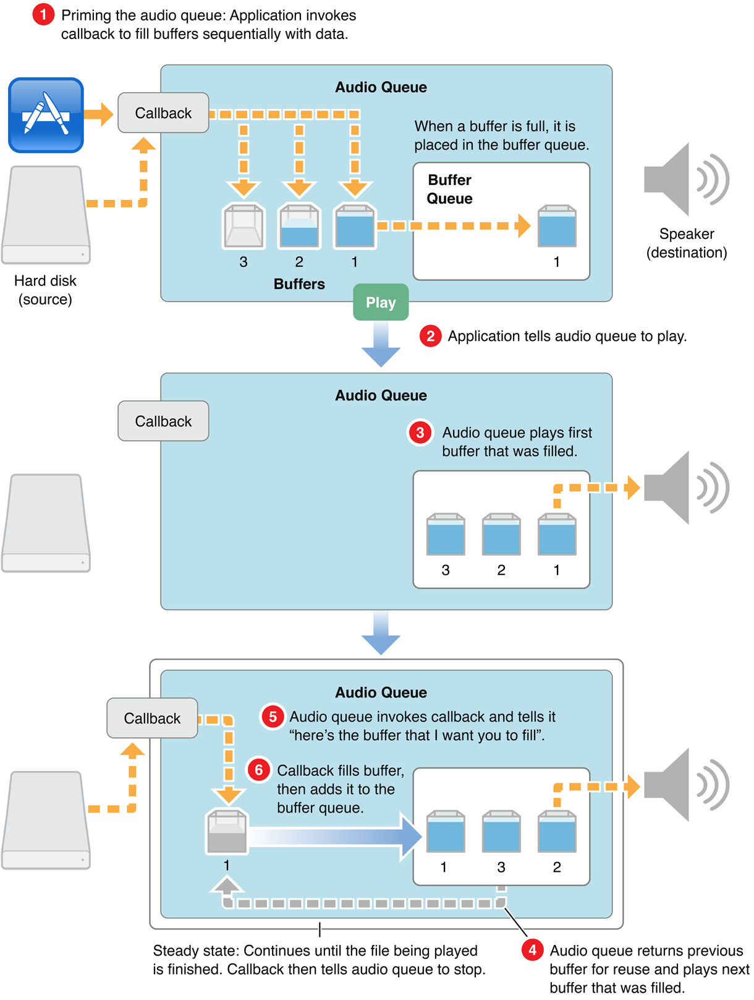
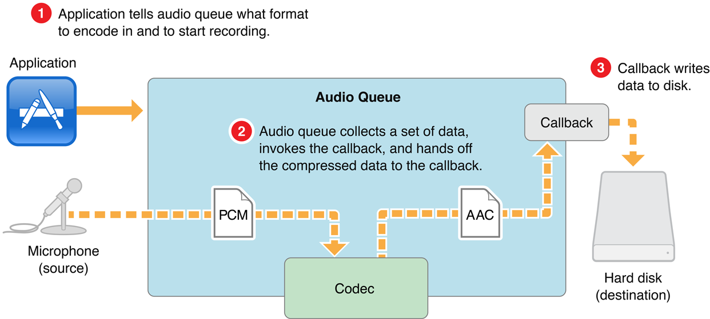
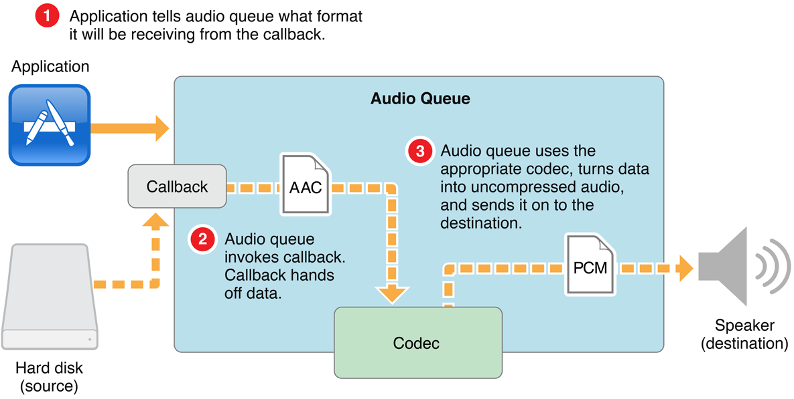

## What Is an Audio Queue?

Audio Queue（音频队列）是 iOS 或 Mac OS X 中用来 录音 或 播放音频 的软件对象。它由 AudioQueueRef 数据类型表示，在 AudioQueue.h 中声明。AudioToolbox framework中的C语言api，属于Core Audio的一部分

音频队列的工作是:

- 连接音频硬件
- 管理内存
- 根据需要，为压缩音频格式使用编解码器
- 调解录音或回放

音频队列服务允许以 linear PCM、压缩格式（如 Apple Lossless ’ALAC‘ 和 AAC）和其他用户安装了编解码器的格式录制和播放音频。音频队列服务还支持多个音频队列的定时播放和同步，以及音频与视频的同步。


### Audio Queue Architecture

所有的音频队列都具有大体相同的结构，由以下部分组成：

- 一组 音频队列缓冲区，每个缓冲区都是一些音频数据的临时存储库
- 缓冲队列，用于音频队列缓冲区的有序列表
- 你写的 音频队列回调函数

该架构根据音频队列是用于录音还是播放而有所变化，不同之处在于音频队列连接输入和输出的方式，以及回调函数的角色

#### Audio Queues for Recording

用 AudioQueueNewInput 函数创建的录音音频队列具有下图所示的结构


录音音频队列的输入端通常连接到外部音频硬件，如麦克风。在iOS中，音频来自用户内置麦克风或耳机麦克风连接的设备。在Mac OS X的默认情况下，音频来自用户在系统首选项中设置的系统默认音频输入设备。

录音音频队列的输出端使用您编写的回调函数。当记录到磁盘时，回调将从其音频队列接收到的新音频数据的缓冲区写入音频文件。然而录制音频队列也可以用其他方式使用，例如回调可以直接向app提供音频数据，而不是将其写入磁盘。

每个音频队列，无论是用于录制还是播放，都有一个或多个音频队列缓冲区。这些缓冲区按照特定序列排列。在图中，音频队列缓冲区根据它们被填充的顺序进行编号，这与它们被传递给回调函数的顺序相同。您将了解音频队列如何使用缓冲队列在  [The Buffer Queue and Enqueuing](https://developer.apple.com/library/archive/documentation/MusicAudio/Conceptual/AudioQueueProgrammingGuide/AboutAudioQueues/AboutAudioQueues.html#//apple_ref/doc/uid/TP40005343-CH5-SW9)

#### Audio Queues for Playback

用 AudioQueueNewOutput 函数创建的播放音频队列具有下图所示的结构




在播放音频队列中，回调函数在输入端。回调函数负责从磁盘(或其他来源)获取音频数据并将其传递给音频队列。播放回调也告诉他们的音频队列停止时，没有更多的数据可以播放。你将在 [The Playback Audio Queue Callback Function](https://developer.apple.com/library/archive/documentation/MusicAudio/Conceptual/AudioQueueProgrammingGuide/AboutAudioQueues/AboutAudioQueues.html#//apple_ref/doc/uid/TP40005343-CH5-SW11)中了解更多关于这个回调的信息。

播放音频队列的输出通常连接到外部音频硬件，如扬声器。在iOS中，音频转到用户选择的设备上，例如扬声器或耳机。在Mac OS X的默认情况下，音频转到系统的默认音频输出设备，由用户在系统首选项中设置。


### Audio Queue Buffers

音频队列缓冲区是一种结构体数据，类型为 AudioQueueBuffer，在AudioQueue.h头文件中声明

``` c
typedef struct AudioQueueBuffer {
    const UInt32   mAudioDataBytesCapacity;
    void *const    mAudioData;
    UInt32         mAudioDataByteSize;
    void           *mUserData;
} AudioQueueBuffer;
typedef AudioQueueBuffer *AudioQueueBufferRef;
```

mAudioData 字段指向缓冲区本身:  一个内存块，作为正在播放或录音的音频数据的瞬态块的容器。其他字段中的信息帮助音频队列管理缓冲区。

音频队列可以使用任意数量的缓冲区。您的应用程序指定了数量，一个典型的数字是3。这允许一个忙于写入磁盘，而另一个正在填充新的音频数据。如果需要补偿磁盘I/O延迟，则可以使用第三个缓冲区

音频队列为其缓冲区执行内存管理：

- 当你调用 AudioQueueAllocateBuffer 函数时，音频队列会分配一个缓冲区
- 当你通过调用 AudioQueueDispose 函数来释放一个音频队列时，该队列将释放它的缓冲区


### The Buffer Queue and Enqueuing

在这里，您将了解音频队列对象以及您的回调函数如何在录音或播放期间管理缓冲队列。特别是将了解排队，以及如何将音频队列缓冲区添加到缓冲队列中。无论您是实现录音还是播放，回调函数都要处理音频队列缓冲区的排队

#### The Recording Process

当录音时，一个音频队列缓冲区被从输入设备(如麦克风)获得的音频数据填满。缓冲区队列中剩余的缓冲区排在当前缓冲区之后，依次等待音频数据填充。

音频队列按照获取音频数据的顺序将填充的音频数据缓冲区传递给回调。下图演示了使用音频队列时录制的工作原理。




步骤1，录音开始，音频队列用获得的数据填充缓冲区。

在步骤2中，第一个缓冲区已经被填满。音频队列调用回调函数，将完整的缓冲区（缓冲区1）交给它。回调函数（步骤3）将缓冲区的内容写入音频文件。与此同时，音频队列用新获取的数据填充另一个缓冲区（缓冲区2）。

在步骤4中，回调将它刚刚写入磁盘的缓冲区1排队，将其放在后面等待再次填充。音频队列再次调用回调函数（步骤5），将下一个填充满的缓冲区（缓冲区2）交给它。回调函数（步骤6）将这个缓冲区的内容写入音频文件。

这个循环稳定的状态会一直持续，直到用户停止录音。

#### The Playback Process

播放时，一个音频队列缓冲区被发送到输出设备，如扬声器。缓冲区队列中的剩余缓冲区排在当前缓冲区之后，等待依次播放。

音频队列将播放的音频数据缓冲区按播放的顺序传递给你的回调。回调将新的音频数据读入缓冲区，然后将其排队。下图演示了使用音频队列进行播放的原理



1. 启动音频队列: 应用程序调用回调函数来用数据顺序填充缓冲区
2. 应用程序告诉音频队列播放
3. 音频队列首先播放被填满的缓冲区
4. 音频队列返回前一个缓冲区供重用，并播放下一个已填满的缓冲区
5. 音频队列调用回调函数并告诉它"这里是我想让你填充的缓冲区"
6. 回调函数填充缓冲区，然后将其添加到缓冲区队列

在步骤1中，应用程序启动播放音频队列。应用程序对每个音频队列缓冲区调用一次回调，填充它们并将它们添加到缓冲队列中。确保可以在应用程序调用AudioQueueStart函数（步骤2）时立即播放。

在步骤3中，音频队列将第一个缓冲区（缓冲区1）发送到输出。

一旦播放了第一个缓冲区，回放音频队列就进入一个循环稳定状态。音频队列开始播放下一个缓冲区（缓冲区2，步骤4）并调用回调函数（步骤5），将刚刚播放的缓冲区（缓冲区1）交给它。回调函数（步骤6）从音频文件填充缓冲区，然后排队播放。

#### Controlling the Playback Process

音频队列缓冲区总是按照它们排队的顺序播放。然而，音频队列服务通过AudioQueueEnqueueBufferWithParameters 函数为你提供了对播放过程的一些控制。这个函数可以让你:

- 设置缓冲区的精确播放时间。这使您能够支持同步功能
- 在音频队列缓冲区的开始或结束处修剪帧。这允许您删除开头或结尾沉默部分
- 将播放增益设置为缓冲区的粒度

有关设置播放增益的更多信息，请参见 [Audio Queue Parameters](https://developer.apple.com/library/archive/documentation/MusicAudio/Conceptual/AudioQueueProgrammingGuide/AboutAudioQueues/AboutAudioQueues.html#//apple_ref/doc/uid/TP40005343-CH5-SW15)。有关AudioQueueEnqueueBufferWithParameters函数的完整描述，请参见 [Audio Queue Services Reference](https://developer.apple.com/documentation/audiotoolbox/audio_queue_services)


### The Audio Queue Callback Function

通常，使用音频队列服务的大部分编程工作包括编写音频队列回调函数。

在录音或播放期间，音频队列会重复调用回调函数。调用间隔的时间取决于音频队列缓冲区的容量，通常从半秒到几秒不等。

音频队列回调的一个职责是将音频队列缓冲区返回给缓冲队列，无论是用于录音还是播放。回调函数使用AudioQueueEnqueueBuffer 函数将一个缓冲区添加到缓冲区队列的末尾。对于播放，如果你需要更多的控制，你可以使用 AudioQueueEnqueueBufferWithParameters 函数，如 [Controlling the Playback Process](https://developer.apple.com/library/archive/documentation/MusicAudio/Conceptual/AudioQueueProgrammingGuide/AboutAudioQueues/AboutAudioQueues.html#//apple_ref/doc/uid/TP40005343-CH5-SW16)中所述

#### The Recording Audio Queue Callback Function

本节将介绍音频录制到磁盘文件的情况下编写的回调函数。下面是一个录音音频队列回调的原型，在AudioQueue.h头文件中声明:

``` c
AudioQueueInputCallback (
    void                               *inUserData,
    AudioQueueRef                      inAQ,
    AudioQueueBufferRef                inBuffer,
    const AudioTimeStamp               *inStartTime,
    UInt32                             inNumberPacketDescriptions,
    const AudioStreamPacketDescription *inPacketDescs
);
```

一个录音音频队列，在调用你的回调函数时，提供了回调函数需要的所有东西来将下一组音频数据写入音频文件:

- inUserData 通常是一个自定义的结构体，你设置它来包含音频队列及其缓冲区的状态信息、音频文件对象(AudioFileID类型)表示你写入的文件、以及文件的音频数据格式等信息
- inAQ 是调用回调函数的音频队列
- inBuffer 是一个音频队列缓冲区，由音频队列新填充，包含回调函数需要写入磁盘的新数据。数据已经根据您在自定义结构体中指定的格式进行了格式化 (在inUserData参数中传递)。有关这方面的更多信息，请参阅[Using Codecs and Audio Data Formats](https://developer.apple.com/library/archive/documentation/MusicAudio/Conceptual/AudioQueueProgrammingGuide/AboutAudioQueues/AboutAudioQueues.html#//apple_ref/doc/uid/TP40005343-CH5-SW14)
- inStartTime 是缓冲区中第一个样本的样本时间。对于基础的录音功能，你的回调不使用这个参数
- inNumberPacketDescriptions 是 inPacketDescs 参数中报文描述的个数。如果您正在录制VBR(可变比特率)格式，音频队列将为这个参数提供一个值给您的回调，回调又将它传递给 AudioFileWritePackets 函数。CBR(恒定比特率)格式不使用包描述。对于CBR记录，音频队列将此设置和 inPacketDescs 参数设置为NULL。
  inPacketDescs 是一组与缓冲区中的样本对应的数据包描述。同样，如果音频数据是VBR格式的，那么音频队列将为该参数提供值，并且回调将其传递给 AudioFileWritePackets 函数(在AudioFile.h头文件中声明)。

有关录音回调的更多信息，请参见[Recording Audio](https://developer.apple.com/library/archive/documentation/MusicAudio/Conceptual/AudioQueueProgrammingGuide/AQRecord/RecordingAudio.html#//apple_ref/doc/uid/TP40005343-CH4-SW1) ， [Audio Queue Services Reference](https://developer.apple.com/documentation/audiotoolbox/audio_queue_services)

#### The Playback Audio Queue Callback Function

本节介绍您为从磁盘文件中播放音频情况下编写的回调函数。下面是一个播放音频队列回调的原型，在AudioQueue.h头文件中声明:

``` c
AudioQueueOutputCallback (
    void                  *inUserData,
    AudioQueueRef         inAQ,
    AudioQueueBufferRef   inBuffer
);
```

播放音频队列，在调用你的回调函数时，提供了回调函数需要从音频文件中读取下一组音频数据:

- inUserData 通常是一个自定义结构体，你设置它来包含音频队列及其缓冲区的状态信息、音频文件对象(AudioFileID类型)表示你写入的文件、以及文件的音频数据格式信息。在播放音频队列的情况下，回调函数使用此结构体中的字段跟踪当前包索引
- inAQ 是调用回调函数的音频队列
- inBuffer 是一个音频队列缓冲区，由音频队列提供，你的回调函数用来填充从正在播放的文件中读取的下一组数据

如果您的应用程序正在播放 VBR 数据，那么回调函数需要获取它正在读取的音频数据的数据包信息。它通过调用AudioFileReadPackets 函数来做到这一点，该函数声明在AudioFile.h头文件中。然后，回调函数将包信息放在自定义数据结构体中，使其对播放音频队列可用。

有关回放回调的更多信息，请参见 [Playing Audio](https://developer.apple.com/library/archive/documentation/MusicAudio/Conceptual/AudioQueueProgrammingGuide/AQPlayback/PlayingAudio.html#//apple_ref/doc/uid/TP40005343-CH3-SW1) 、[Audio Queue Services Reference](https://developer.apple.com/documentation/audiotoolbox/audio_queue_services)


## Using Codecs and Audio Data Formats

音频队列服务根据需要使用编解码器 (音频数据编码 / 解码组件) 在音频格式之间进行转换。您的录音或播放程序可以使用任何安装有编解码器的音频格式。您不需要编写自定义代码来处理各种音频格式。具体来说，回调不需要知道数据格式。

下面是工作原理。每个音频队列都有一个音频数据格式，以 AudioStreamBasicDescription 结构体表示。当您指定格式 (在结构体的 mFormatID 字段中) 时，音频队列将使用适当的编解码器。然后你指定采样率和声道数，这就是它的全部。您将在 [Recording Audio](https://developer.apple.com/library/archive/documentation/MusicAudio/Conceptual/AudioQueueProgrammingGuide/AQRecord/RecordingAudio.html#//apple_ref/doc/uid/TP40005343-CH4-SW1) 和 [Playing Audio](https://developer.apple.com/library/archive/documentation/MusicAudio/Conceptual/AudioQueueProgrammingGuide/AQPlayback/PlayingAudio.html#//apple_ref/doc/uid/TP40005343-CH3-SW1) 中看到设置音频数据格式的示例


录音音频队列使用下图所示的已安装的编解码器：



在步骤1中，应用程序告诉音频队列开始录制，并告诉它要使用的数据格式。在步骤2中，音频队列获取新的音频数据，并使用编解码器根据您指定的格式对其进行转换。然后音频队列调用回调函数，给它一个包含对应格式的音频数据的缓冲区。在第3步中，回调函数将格式化的音频数据写入磁盘。同样，回调不需要知道数据格式。


播放音频队列使用如下图所示的安装的编解码器：



步骤1中，您的应用程序告诉音频队列开始播放，并告诉它包含在音频文件中要播放的数据格式。在第2步中，音频队列调用您的回调，它从音频文件中读取数据。回调将原始格式的数据转移到音频队列中。在步骤3中，音频队列使用适当的编解码器，然后将音频发送到目的地。

音频队列可以使用任何已安装的编解码器，不管是Mac OS X自带的还是第三方提供的。要指定要使用的编解码器，需要将其四个字符的代码ID提供给音频队列的AudioStreamBasicDescription 结构。你将在 [Recording Audio](https://developer.apple.com/library/archive/documentation/MusicAudio/Conceptual/AudioQueueProgrammingGuide/AQRecord/RecordingAudio.html#//apple_ref/doc/uid/TP40005343-CH4-SW1)中看到例子


## Audio Queue Control and State

音频队列在创建之后和释放之前拥有生命周期。你的应用程序管理这个生命周期，并控制音频队列的状态，使用 AudioQueue.h 头文件中声明的六个函数:

- **Start** (`AudioQueueStart`)，调用开始录音或播放
- **Prime** (`AudioQueuePrime`)，对于播放，在调用 AudioQueueStart 之前调用，以确保有数据可以立即用于音频队列播放。这个功能与录音无关
- **Stop** (`AudioQueueStop`)，调用重置音频队列 (见下面的描述AudioQueueReset)，然后停止录制或播放。播放音频队列回调在没有更多数据要播放时调用此函数
- **Pause** (`AudioQueuePause`)，调用来暂停录音或播放，而不影响缓冲区或重置音频队列。要继续，调用' AudioQueueStart '函数
- **Flush** (`AudioQueueFlush`)，在将最后一个音频队列缓冲区排队后调用，以确保所有缓冲的数据以及正在处理中的所有音频数据都被录制或播放
- **Reset** (`AudioQueueReset`)，调用并立即使音频队列静音，删除之前使用的所有缓冲区，并重置所有解码器和DSP状态。

你可以在同步或异步模式下使用 AudioQueueStop 函数:

- Synchronous 停止立即发生，而不考虑以前缓冲的音频数据

- Asynchronous 在所有排队缓冲区已经播放或记录后停止


## Audio Queue Parameters

音频队列具有可改变的设置称为 **parameters**。每个parameters都有一个枚举常量作为key，一个浮点数作为value。parameters通常用于播放，而不是录音。

你的应用程序可以通过两种方式设置音频队列参数:

- 每个音频队列，使用 AudioQueueSetParameter 函数。这让你可以直接更改音频队列的设置。这些改变立即生效。
- 每个音频队列缓冲区，使用AudioQueueEnqueueBufferWithParameters函数。这允许您分配音频队列设置，实际上，音频队列缓冲区在您排队时携带它。这些更改在音频队列缓冲区开始播放时生效。

在这两种情况下，音频队列的参数设置一直有效，直到您更改它们。

你可以通过AudioQueueGetParameter函数随时访问音频队列的当前参数值。有关获取和设置参数值的功能的完整描述，请参见 [Audio Queue Services Reference](https://developer.apple.com/documentation/audiotoolbox/audio_queue_services)


[Audio Queue Services Programming Guide](https://developer.apple.com/library/archive/documentation/MusicAudio/Conceptual/AudioQueueProgrammingGuide/Introduction/Introduction.html#//apple_ref/doc/uid/TP40005343-CH1-SW1)